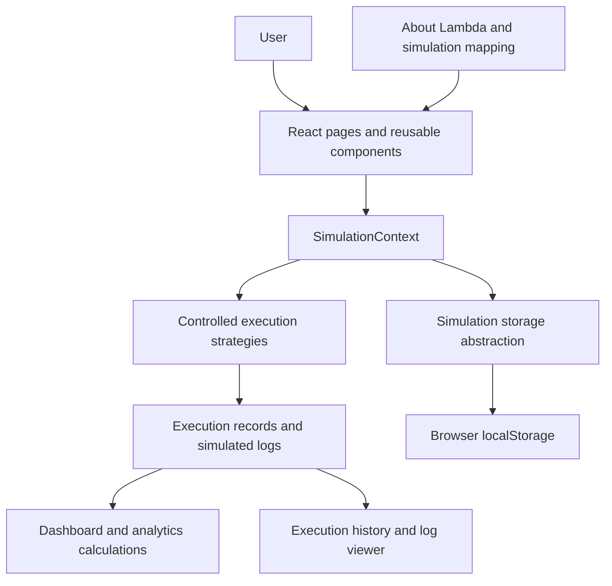

# LambdaLab — AWS Lambda Simulator

## 1. Project Overview

LambdaLab is an academic simulation of selected AWS Lambda concepts, developed for **BCSE355L Cloud Architecture Design**. It provides a browser-based interface for creating simulated functions, supplying JSON test events, recording simulated invocations, and reviewing execution history and observability data.

**Simulation Mode:** LambdaLab does not connect to AWS infrastructure or an AWS account. It does not deploy functions or invoke AWS services.

## 2. Objective

The objective is to demonstrate the core workflow and terminology of AWS Lambda in a safe, local application. Users can explore how function configuration, runtimes, handlers, event input, invocation outcomes, logs, and monitoring fit together without provisioning cloud resources.

## 3. AWS Lambda Concepts Simulated

- **Functions:** Named records with a description, runtime, handler, code text, and a selected simulation behavior.
- **Runtimes:** Simulated Python, Node.js, and Java version labels. No language runtime is launched.
- **Handlers:** Entry-point strings stored and displayed as function configuration. They are not called to execute the saved source.
- **Events:** Named JSON objects associated with a simulated function.
- **Invocations:** Controlled simulator runs that create a unique invocation ID and a success or error record.
- **Execution:** One of four fixed internal strategies produces an output or error after a bounded delay.
- **Logs:** Simulated INFO, WARN, and ERROR entries generated for the invocation lifecycle.
- **Monitoring:** Dashboard and analytics views summarize the saved invocation records.

## 4. Features

- Responsive dashboard with invocation metrics, recent executions, function activity, runtime trends, and recent errors.
- Create, view, search, filter, edit, and delete simulated functions.
- Store code as editable text with starter templates for Python, Node.js, and Java.
- Create, edit, select, validate, and delete JSON test events associated with functions.
- Run controlled **Hello World**, **Calculator**, **Text Analyzer**, and **JSON Processor** behaviors.
- Demonstrate errors such as invalid JSON, missing input, invalid configuration, simulated runtime errors, and bounded simulated timeouts.
- Inspect invocation status, ID, duration, event, output or error, and generated logs.
- Search, filter, sort, and paginate execution history; open detailed execution records.
- Filter and search simulated log entries by function, status, and level.
- Load optional demo functions and sample invocation history.
- Persist simulator data in browser `localStorage`.
- Export application data as JSON and validate/import a LambdaLab JSON backup with confirmation before replacing current data.
- Reset local simulator data through a confirmation dialog.
- Read the **About Lambda** educational page and the simulation mapping.

## 5. Enhancement: Lambda Observability Dashboard

LambdaLab’s observability views calculate metrics from saved execution history rather than from live AWS telemetry. The dashboard and Analytics page include:

- Total, successful, and failed invocations.
- Success and error rates.
- Average, minimum, and maximum completed simulated execution durations.
- Most frequently invoked function and invocation counts by function.
- Runtime distribution and average duration by function.
- Daily invocation outcomes and success/failure trends.
- Filters for function, runtime, status, and date range.

When records are unavailable, duration metrics and visualizations use appropriate empty states instead of invalid numeric output.

## 6. Technology Stack

Technologies and dependencies declared by the project:

- **React 18** for the component-based interface.
- **JavaScript** with ES modules.
- **Vite 6** for the development server and production build.
- **CSS** for application styling and responsive layouts.
- **lucide-react** for icons.
- **Browser `localStorage`** through a centralized storage abstraction.

The project does not use AWS SDKs, AWS services, or a charting dependency. Charts are rendered by the application using HTML/CSS and SVG.

## 7. Architecture



Function code is stored as text. Invocation results come from fixed internal strategies and do not evaluate or execute user-supplied source code.

## 8. Project Structure

```text
src/
  components/   Shared shell, navigation, dialogs, editors, status, and UI components
  pages/        Dashboard, functions, function details, executions, logs, analytics,
                settings, help, and About Lambda pages
  simulator/    Controlled invocation engine and simulated log generation
  state/        Central React context, validation, migrations, and state updates
  storage/      Browser persistence and imported-data validation
  data.js       Runtime and behavior choices, starter templates, initial state,
                optional demo fixtures, and shared formatters
  App.jsx       Hash-based page routing
  main.jsx      React application entry point and stylesheet import
  styles.css    Application design system and responsive styles
index.html      HTML entry point and page metadata
package.json    Project dependencies and npm scripts
```

## 9. Installation

Install a current Node.js LTS release with npm, then run these commands from the project root:

```bash
npm install
```

## 10. Running Locally

Start the Vite development server:

```bash
npm run dev
```

Open the local URL printed by Vite (normally `http://localhost:5173`).

To create a production build:

```bash
npm run build
```

To serve the production build locally after building:

```bash
npm run preview
```

Run the production-build check before publishing:

```bash
npm run deploy:check
```

## 11. Deployment

LambdaLab is a static React/Vite application. Netlify is the recommended deployment target because it can build the project directly from its GitHub repository and serve the generated static assets over HTTPS.

### Deploy manually through Netlify

1. From the project root, run `npm install` and commit the generated `package-lock.json` so the deployment uses reproducible dependency versions. Push it with the source, `package.json`, `.gitignore`, and `netlify.toml` to a GitHub repository. Do not commit `node_modules`, `dist`, local `.env` files, or simulator data exports.
2. In Netlify, choose **Add new site** → **Import an existing project**, authorize GitHub if needed, and select the LambdaLab repository.
3. Use the repository root as the base directory. The checked-in `netlify.toml` configures the build command as `npm run build` and the publish directory as `dist`.
4. Start the deployment from Netlify. Netlify will provide a public HTTPS URL after its build succeeds and will provision HTTPS for the site.
5. Open the deployed URL and verify the dashboard, About Lambda, function creation, a successful and failed invocation, execution history, logs, analytics filters, and browser refresh. Refresh a non-default hash route such as `/#/about-lambda`; the redirect configuration also provides an index fallback for static-host routing.

No deployment is performed by this project’s scripts or by this preparation. No environment variables are required: the simulator is client-side and does not use AWS credentials or connect to AWS infrastructure. Do not add secrets to frontend environment variables.

For local deployment verification, run `npm run deploy:check` and then `npm run preview`; Vite prints the local preview address. The local preview address is for development verification only and is not part of the production application.

## 12. Usage

1. **Create a function:** Open **Functions**, choose **Create function**, and provide a name, description, simulated runtime, handler, code text, and simulation behavior.
2. **Create a test event:** Open a function’s details, use **Test Event** to enter a name and JSON object, validate it, and save it. Example: `{"name":"VIT Chennai"}`.
3. **Invoke a function:** Select a saved test event or edit the JSON input, then choose **Run test** or **Invoke**. The simulator uses the selected predefined behavior; it does not execute the code text.
4. **Inspect the result:** Review the generated invocation ID, status, duration, output or error, and simulated execution logs on the function details page.
5. **View logs:** Open **Logs** to search and filter generated log entries. Select an entry associated with an invocation to inspect its complete record.
6. **View execution history:** Open **Executions** to search, filter, sort, and inspect invocation records and their events, results, errors, timestamps, durations, and logs.
7. **View analytics:** Open **Analytics** to review execution-derived metrics and charts. Apply function, runtime, status, or date-range filters as needed.
8. **Back up local data:** Open **Settings** and choose **Export Data** or **Import Data**. Import validates the JSON and asks for confirmation before replacing the current workspace.

## 13. Limitations

- This project simulates AWS Lambda concepts; it is **not connected to or powered by AWS infrastructure**.
- It does not deploy functions, provision cloud resources, or connect to AWS Lambda, API Gateway, DynamoDB, CloudWatch, or any AWS account.
- The entered function source is stored as text and is never executed.
- Invocations use four predefined behaviors; arbitrary user-defined runtime behavior is not interpreted.
- Runtime labels are configuration examples only; real Python, Node.js, and Java runtimes are not started.
- Durations and logs are generated by the simulator and are not measurements or telemetry from AWS.
- Data is stored in the current browser’s local storage unless the user exports it. Clearing browser storage can remove saved data.
- Do not enter credentials, API keys, personal data, or other secrets. Exported JSON files include saved code, events, results, and logs.

## 14. Future Enhancements

Possible future work, not currently implemented:

- Add focused automated tests for simulator behaviors, migrations, import validation, and analytics.
- Add richer event templates and additional controlled simulation strategies.
- Add accessible chart summaries and downloadable analytics reports.
- Improve import/export feedback with a preview of record counts before confirmation.
- Add optional data retention controls for large local execution histories.
