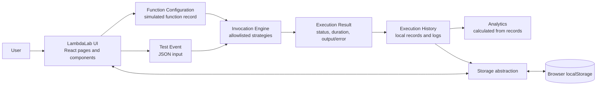
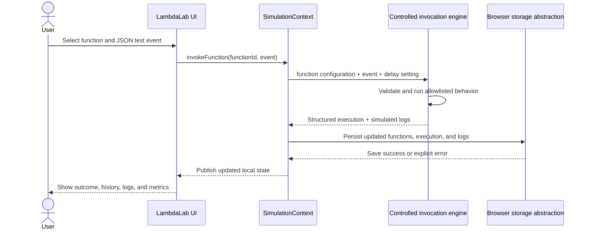
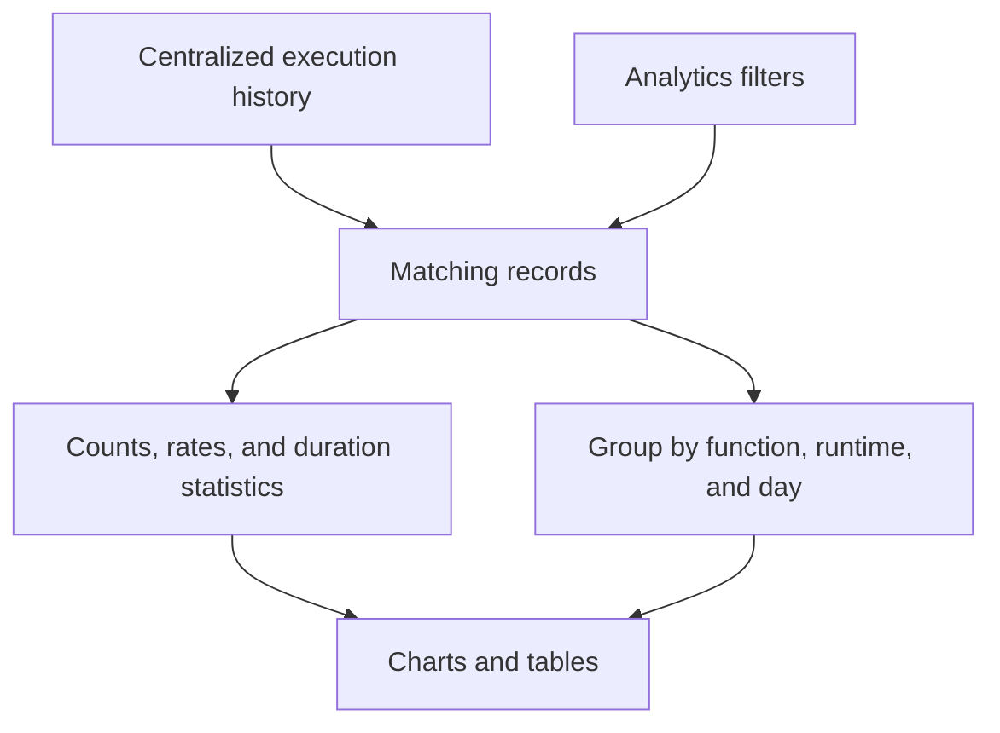

# LambdaLab Architecture

## Scope and simulation boundary

LambdaLab is a browser-based academic simulation of AWS Lambda concepts. The **actual application** consists of the React/Vite interface, in-browser state management, controlled JavaScript simulation strategies, browser storage, and analytics derived from local execution records.

AWS Lambda, its language runtimes, handlers, event sources, execution environment, and cloud monitoring are **concepts represented by the simulator only**. LambdaLab does not connect to AWS, deploy code, start Python/Node.js/Java runtimes, or execute the source text entered by a user.

## 1. High-level architecture



The requested workflow in sequence is:

```text
User
→ LambdaLab UI
→ Function Configuration
→ Test Event
→ Invocation Engine
→ Execution Result
→ Execution History
→ Analytics
```

Function configuration and a JSON test event are read by the invocation engine. It runs one predefined strategy, returns a structured result, and the state layer records it. Dashboard and analytics views derive their values from those records.

## 2. Frontend architecture

- **`src/main.jsx`** mounts the React application and imports the global stylesheet.
- **`src/App.jsx`** maps hash-based routes to page components and wraps them in the simulation provider and shared shell.
- **`src/components/`** contains reusable interface elements: navigation, app shell, code editor, dialogs, status badges, metrics, toasts, and empty/loading/error panels.
- **`src/pages/`** contains the dashboard, function list/details, execution history, logs, analytics, settings, help, and About Lambda screens.
- **`src/styles.css`** defines the application styling and responsive layouts.

Pages read centralized state using `useSimulation()` and call provider actions for mutations. UI components do not connect to cloud services.

## 3. State and data architecture

`src/state/SimulationContext.jsx` owns the shared application state and update operations. The state includes:

- **Functions:** name, description, simulated runtime, handler string, source-code text, controlled behavior, timestamps, status, and invocation summary.
- **Test events:** function association, event name, JSON object, and timestamps.
- **Executions:** invocation and function identifiers, event, status, start/completion timestamps, duration, output or error, and generated log stream.
- **Logs:** searchable entries associated with an execution.
- **Settings:** default simulated runtime, bounded simulator delay, and demo-data preference.
- **Demo metadata:** whether the optional sample workspace has been loaded.

State updates are validated in the provider, normalized during storage loading/import, persisted through one storage abstraction, and then published to React consumers. Execution history retains records when a function is deleted; its test events are removed with the function.

## 4. Lambda simulation workflow

1. A user creates a function configuration with a supported runtime label, handler text, code text, and one of the fixed behaviors.
2. LambdaLab associates example JSON test events with the function; the user can also create or edit events.
3. The user chooses a test event or supplies JSON input and starts an invocation.
4. The simulation engine validates the event and configuration, waits for a bounded period, then dispatches to the selected internal behavior.
5. The engine returns a success or error result and generated logs.
6. The provider adds the execution and logs to local state, updates function invocation metadata, persists the state, and publishes it to the UI.
7. History, Logs, Dashboard, and Analytics pages display or aggregate those saved records.



## 5. Execution lifecycle

The controlled engine is implemented in **`src/simulator/executionEngine.js`**. Its behavior allowlist contains:

- **Hello World:** builds a greeting from an optional `name`.
- **Calculator:** validates and adds finite numeric `a` and `b` values.
- **Text Analyzer:** calculates character and word counts from `text`.
- **JSON Processor:** selects requested fields from an input `data` object.

The engine does not evaluate function code. It simulates bounded execution time and returns a record containing an invocation ID, function metadata, test-event information, input, status, start and completion times, duration, output or error, and logs.

Controlled error scenarios include malformed JSON, missing required input, invalid configuration, simulated runtime error, and a bounded timeout. These scenarios do not freeze the browser or execute arbitrary code.

## 6. Persistence architecture

**`src/storage/simulationStorage.js`** is the boundary for browser `localStorage` access. It loads and checks the saved schema, returns fresh state when no state exists, reports corrupt or unsupported data, and exposes a save operation that surfaces storage errors.

On provider initialization, saved records are normalized and migrated to the current schema. Successful mutations are committed through the storage abstraction. Settings also offers JSON export and import; imported data is structurally validated before the user confirms replacement. Reset creates a fresh workspace after confirmation.

The browser storage is local to the browser profile and device. It is not a cloud database or synchronization service.

## 7. Analytics architecture

Dashboard and Analytics calculations use execution records from centralized state; they do not read fixed metrics or query AWS telemetry.

- The **Dashboard** derives overall invocation counts and success rate from execution history, uses completed records for average duration, and groups recent executions by local day and runtime.
- The **Analytics** page first applies function, runtime, status, and date-range filters, then derives totals, success/error rates, completed-duration statistics, per-function counts and averages, runtime distribution, and time-bucket trends.
- Missing or invalid duration data is excluded from completed-duration averages. Empty datasets show empty states or placeholder values rather than invalid chart values.
- Optional demo executions are explicitly labeled demo records and can be loaded only through the demo-data feature.



## Actual versus simulated components

| AWS Lambda concept | LambdaLab representation | Actual connection |
|---|---|---|
| Lambda service | Browser-based simulator UI and state | None |
| Function | Local function configuration record | Not deployed |
| Runtime | Runtime label on the configuration | Not launched |
| Handler/code | Saved handler string and editable source text | Not executed |
| Event source/input | User-managed JSON test event | No external event source |
| Invocation | Allowlisted local simulation strategy | No AWS invocation |
| Execution logs/monitoring | Generated logs and locally calculated analytics | No CloudWatch or AWS telemetry |
